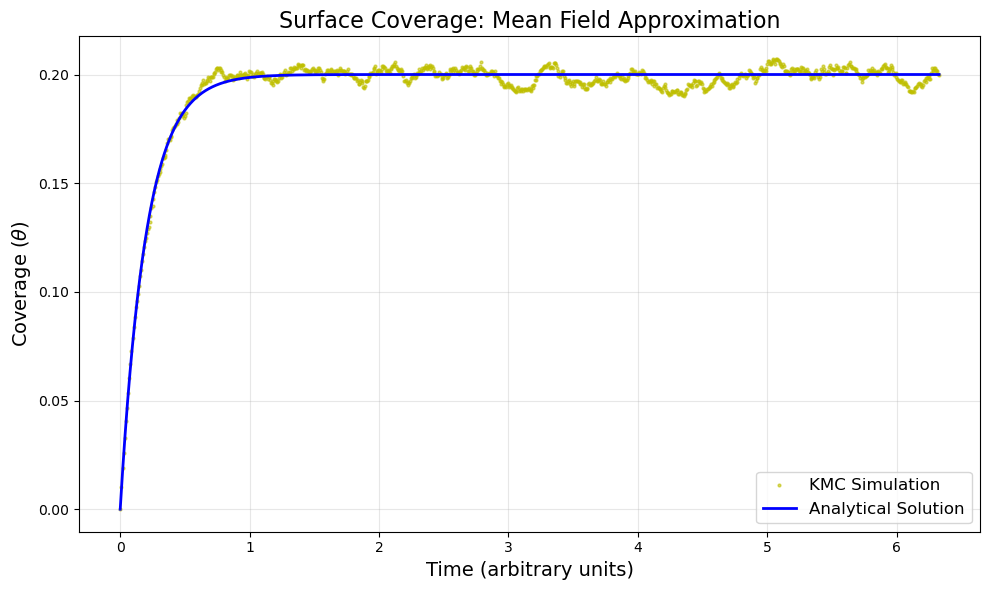
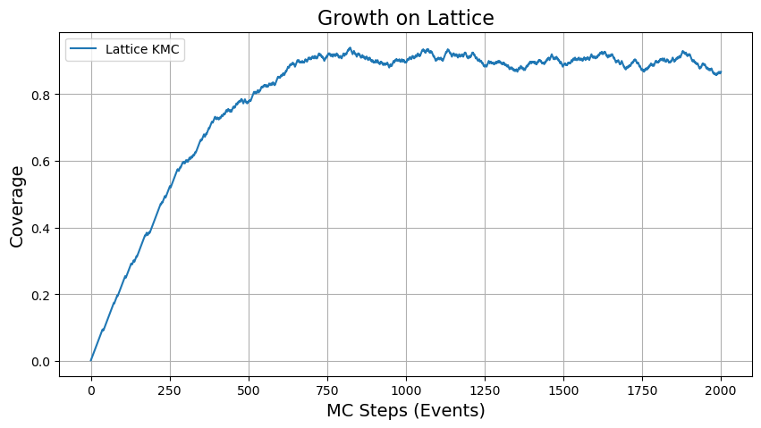

# Kinetic Monte Carlo Simulation of Surface Growth

A Python implementation of a **rejection-free Kinetic Monte Carlo (KMC)** algorithm that simulates thin-film surface growth through adsorption and desorption on an atomistic lattice. The project starts with a mean-field model validated against an analytical solution, then extends to a full 3D lattice simulation with neighbor-dependent (coordination-dependent) rates.



## Highlights

- Implemented the **rejection-free (BKL / n-fold way) KMC algorithm** from scratch: event catalog, rate-weighted event selection, and Poisson-distributed time advancement (`dt = -ln(u) / R_total`).
- **Validated the simulation against an analytical solution** of the Langmuir adsorption/desorption model, with KMC results closely tracking the theoretical coverage curve.
- Built a custom **`EventList` data structure** with memory-efficient index recycling and dynamic array growth to manage thousands of possible events.
- Modeled **coordination-dependent desorption rates** (`k ∝ 1/n_neighbors`) so that atoms with more neighbors are more strongly bound, and enforced **geometric constraints** (buried atoms cannot desorb).
- Used **local event-list updates**: only the changed atom and its neighbors are recomputed after each event, instead of rescanning the whole system.
- Visualized the atomic structure and growth trajectory as an interactive movie using ASE.

## Approach

The simulation is built in two stages.

### 1. Mean-field model (no lattice, constant rates)

Tracks only the number of occupied and empty sites, with adsorption rate `rA` and desorption rate `rD`. Coverage evolves toward the steady state

```
θ(t) = rA / (rA + rD) · (1 − exp(−(rA + rD) t))
```

The KMC result (10,000 sites, 100,000 events) is compared directly to this analytical curve.

### 2. Lattice model (neighbor-dependent rates)

A simple-cubic Cu substrate (20×20, periodic in X and Y) with a layer of placeholder "empty" sites on top. Each KMC step:

1. **Build the event list** with all possible adsorption and desorption events and their rates
2. **Draw an event** randomly, weighted by its rate
3. **Execute the event** (change the atom type at that site)
4. **Advance time** using the Poisson waiting-time formula
5. **Update the event list** locally for the affected atoms
6. Repeat

| Process | Rule | Rate |
|---|---|---|
| Adsorption | Site must be empty and supported by substrate or another adsorbate | Constant (2.0) |
| Desorption | Atom must have nothing on top of it | `1 / n_neighbors` (100 if isolated) |



## Tech Stack

- **Python**
- **NumPy** for numerics and random sampling
- **Matplotlib** for plotting
- **ASE** (Atomic Simulation Environment) for building and visualizing atomic structures
- **ASAP3** for fast neighbor lists
- **Jupyter Notebook**

## Getting Started

```bash
git clone https://github.com/<your-username>/<your-repo>.git
cd <your-repo>

pip install numpy matplotlib ase asap3 jupyter nglview
jupyter notebook Exercise03-KMC-Solution.ipynb
```

> **Note:** ASAP3 is easiest to install through conda (`conda install -c conda-forge asap3`). The 3D structure viewer works best in a Jupyter environment.

## Project Structure

```
├── Exercise03-KMC-Solution.ipynb   # Full simulation and analysis
├── images/                          # Result plots
└── README.md
```

## Key Classes

- **`EventList`**: stores every possible event as (rate, initial site, final site); handles event addition, removal, rate-weighted sampling, and time advancement.
- **`SurfaceGrowthKMC`**: builds the lattice, defines adsorption and desorption physics, executes events, tracks surface coverage, and stores snapshots for visualization.

## Possible Extensions

- Add surface diffusion (hopping) events
- Explore temperature dependence with Arrhenius rates (`k = ν·exp(−E/kT)`)
- Study how rate parameters affect growth mode and surface roughness
- Speed up event selection with a tree-based or binned sampler

## Context

Developed as part of a computational materials / atomistic simulation course exercise on Kinetic Monte Carlo methods.
